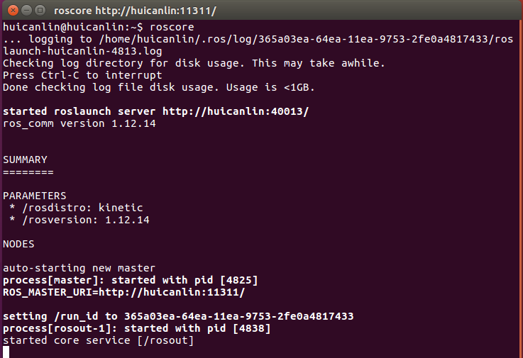
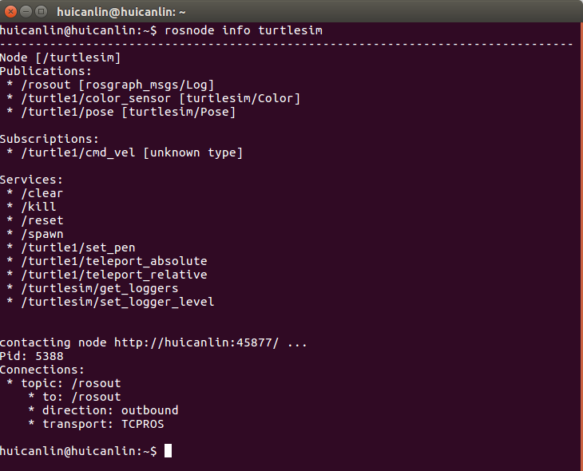
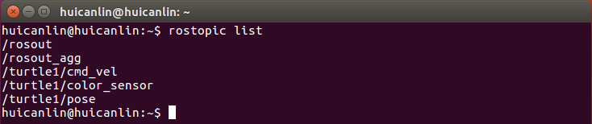
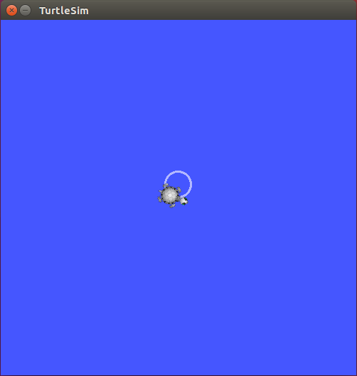
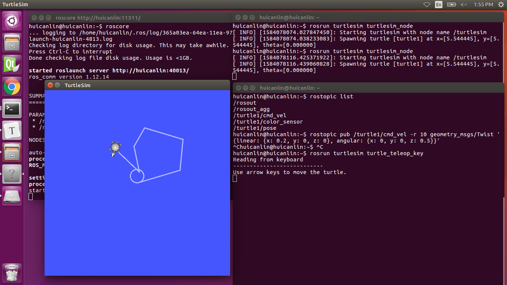

## ROS教程_1.1入门

### 1.1.1 ROS简介

随着科技飞速发展，尤其是人工智能技术的日新月异，研发出的机器人平台不可胜数，如下图所示。但是各平台之间缺乏统一的标准，不利于跨平台交互、技术交流、沿承和应用，在此背景下，ROS应运而生。

<div align=center></div>
<div align=center>图1 各种各样的机器人</div>

ROS是开源的机器人操作系统(robot operating system, ROS)，是一系列软件库和工具的集合，有助于构建跨多种机器人平台的机器人应用。2007年，由Stanford的人工智能实验室开发，后由Willow Garage继续维护和开发。2013年起，由OSRF (Open Source Robotics Foundation)进行管理。

### 1.1.2 ROS主要特征

既然称为机器人操作系统，那么与熟知的计算机操作系统有何异同？

<div align=center></div>
<div align=center>图2 ROS vs OS</div>

如图2所示，ROS具有两方面的属性： 

- 作为操作系统，提供标准的系统服务：
  - 硬件抽象
  - 底层设备控制
  - 实现常用的功能
  - 进程之间的消息传递
  - 包(package)的管理

- 一套用户贡献的软件包（组织成称为堆栈的集合），实现常见的机器人功能，如SLAM、路径规划、感知、仿真等。

ROS适用于各种各样的机器人：

<div align=center></div>
<div align=center>图3 使用ROS的机器人</div>

查阅更多机器人：http://wiki.ros.org/Robots

ROS采用分布式架构：

<div align=center></div>
<div align=center>图4 ROS的分布式架构</div>

### 1.1.3 ROS主要概念

（1）Nodes(节点)

- 单用途可执行程序

例如: 传感器驱动程序，执行器驱动程序，地图构建，路径规划，UI等。

- 模块化设计

单独编译，执行和管理

- 节点使用ROS客户端库编写

roscpp: C++客户端库

rospy: python客户端库

- 节点可以发布或订阅话题
- 节点也可以提供或使用服务

（2）Messages and Topics(消息和话题)

- 节点通过发布消息到话题实现与其它节点的通信
- 发布/订阅模型: 1-N 广播

<div align=center></div>
<div align=center>图5 ROS Topics</div>

- 消息是用于节点间通信的严格类型的数据结构；

- 例如，`geometry_msgs/Twist`用于表示速度，可分解为线性和角度部分：

```c++
Vector3 linear
Vector3 angular
```

- 其中，Vector3是另一种消息类型，由以下组成：

```c++
float64 x
float64 y
float64 z
```

（3）Services(服务)

- 同步节点间事务 / RPC 
- 服务/客户端模型：1对1请求响应 
- 服务的功能: 执行远程计算、触发功能/行为；

- 例如:`map_server/static_map`检索机器人用于导航的当前网格图。

（4）ROS Master(ROS主控)

- 使能ROS节点以交互；
- 将其视为ROS目录服务，有点类似DNS，为节点、主题、服务等提供命名和注册服务。

<div align=center></div>
<div align=center>图6 ROS Master</div>

（5）Parameters(参数)

- 一个可通过网络API访问的共享的多变量字典；
- 最适用于静态非二进制数据，如配置参数；
- 在ROS主控内运行。

（6）Stacks and packages(堆栈和包)

- ROS中的软件以packages(包)的形式组织；
- 一个(程序)包，含有一个或多个节点并提供ROS接口；
- 大多数ROS(程序)包都在github中；

<div align=center></div>
<div align=center>图7 ROS Packages</div>

- 多个包组成stack(堆栈)。

<div align=center></div>
<div align=center>图8 ROS Package System</div>

- ROS主要程序包

| package                                    | 功能                             |
| ------------------------------------------ | -------------------------------- |
| [TF](http://wiki.ros.org/tf/Tutorials)     | 维护多个坐标系之间的变换关系     |
| [actionlib](http://wiki.ros.org/actionlib) | 提供标准化的接口用于处理优先任务 |
| [gmapping](http://wiki.ros.org/gmapping)   | 提供使用网格地图的基于激光的SLAM |
| [amcl](http://wiki.ros.org/amcl)           | 用于机器人在2D运动的概率定位系统 |
| [move_base](http://wiki.ros.org/move_base) | 实现移动到目的地的动作           |
| [stage_ros](http://wiki.ros.org/stage_ros) | 多机器人仿真器                   |

### 1.1.4 ROS基本命令

（1）`roscore`

`roscore`是使用ROS时应该首先运行的命令，该命令将开启n                                                                                                                                                                                                                                                                                                                                                                                                                                                                                                                                                                                                                                                                                                                                                                                                                                                                                                                                                                                                                                                                                                                                                                                                                                                                                                                                                                                                                                                                                                                                                                                                                                                                                                                                                                                                                                                                                                                                                                                                                                                                                                                                                                                                                                                                                                                                                                                                                                                                                                                                                                                                                                                                                                                                                                                                                                                                                                                                                                                                                                                                                                                                                                                                                                                                                                                                                                                                                                                                                                                                                                                                                                                                                                                                                                                                                                                                                                                                                                                                                                                                                                                                                                                                                                                                                                                                                                                                                       m：

- ROS Master(主控)
- ROS 参数服务器
- rosout日记节点

<div align=center></div>
<div align=center>图9 roscore</div>

（2）`rosrun`

`rosrun`用于运行节点，使用方法：

```bash
rosrun <package> <executable>
```

使用示例：

```bash
rosrun turtlesim turtlesim_node
```

（3）`rosnode`

使用该命令输出关于ROS节点的调试信息，包括发布、订阅和连接信息，主要命令：

| Command           | 功能                     |
| ----------------- | ------------------------ |
| `rosnode list`    | 列出活动节点             |
| `rosnode ping`    | 测试节点连接             |
| `rosnode info `   | 打印节点信息             |
| `rosnode kill`    | 终止运行的节点           |
| `rosnode machine` | 列出运行于某个机器的节点 |

比较常用的是`rosnode list`和`rosnode info`：

<div align=center></div>
<div align=center>图10 rosnode</div>

（4）`rostopic`

输出话题的信息，能够发布消息到话题上，常用命令及功能：

| Command                         | 功能                     |
| ------------------------------- | ------------------------ |
| `rotopic list`                  | 列出活动话题             |
| `rostopic echo /topic`          | 打印话题消息到窗口       |
| `rostopic info /topic`          | 打印关于话题的信息       |
| `rostopic type /topic `         | 打印话题发布的消息的类型 |
| `rostopic pub /topic type args` | 发布数据到话题           |

<div align=center></div>
<div align=center>图11 rostopic list</div>

使用rostopic pub命令可以发布消息到话题。例如，让turtle以`0.2m/s`的速度前行，可以发布`cmd_vel`消息到话题` /turtle1/cmd_vel`: 

```bash
rostopic pub /turtle1/cmd_vel geometry_msgs/Twist '{linear: {x: 0.2, y: 0, z: 0}, angular: {x: 0, y: 0, z: 0}}'
```

还可以仅仅指定线速度`x`:

```bash
rostopic pub /turtle1/cmd_vel geometry_msgs/Twist '{linear: {x: 0.2}}'
```

有些消息（例如cmd_vel），如果需要连续发布消息，使用`-r`参数并指定循环速率(`Hz`)。例如，使乌龟转圈：

```bash
$ rostopic pub /turtle1/cmd_vel -r 10 geometry_msgs/Twist '{linear: {x: 0.2, y: 0, z: 0}, angular: {x: 0, y: 0, z: 0.5}}'
```

<div align=center></div>
<div align=center>图12 连续循环发布消息</div>

### 1.1.5 Turtlesim Demo

分别在3个Terminal窗口运行如下指令：

```bash
roscore
rosrun turtlesim turtlesim_node
rosrun turtlesim turtle_teleop_key
```

通过键盘控制turtlesim进行移动，如图13所示。

<div align=center></div>
<div align=center>图13 turtlesim_demo</div>

更多关于ROS参考链接：

ROS Wiki: http://wiki.ros.org/

安装: http://wiki.ros.org/ROS/Installation

教程: http://wiki.ros.org/ROS/Tutorials

ROS教学视频: http://www.youtube.com/playlist?list=PLDC89965A56E6A8D6