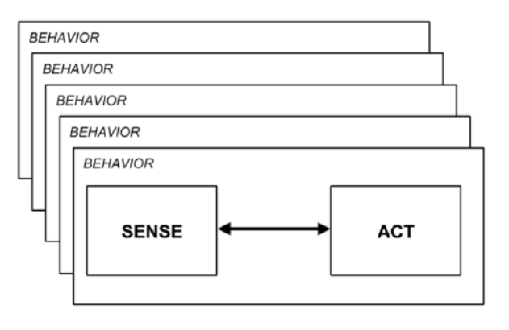
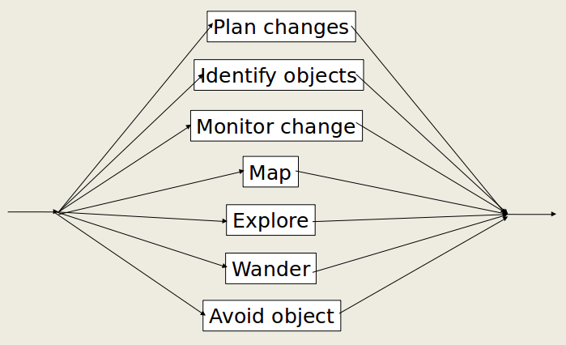
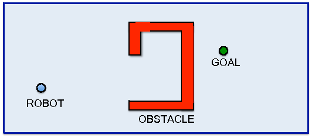

## ROS教程——1.11 基于行为的机器人

本文简介基于行为的机器人的概念和机器人控制思想，基于ROS使用gazebo进行了编程实践演练。演练中的环境采用柳树车库办公室场景，机器人使用了turtlebot，视频中机器人和地板都比较黑，请实用雪亮的双眼！

<div align=center><video width="640" src="./video/demo_video.mp4"/></div>

### 1.11.1 简介

基于行为的机器人反对抽象的定义，而是采用场景化、具体化的解释。基于行为的机器人侧重研究系统结构而不是算法，相比基于符号的机器人，在非结构化、动态环境中的性能非常优越，具有高灵活性、高速度、高鲁棒性、高效等优点[1-2]。

简而言之，基于行为的机器人技术不会使用其环境的内部模型。例如，机器人中没有编程椅子的外观或机器人正在移动的表面的类型，所有信息都是从机器人传感器的输出获取。世界上充满未知并且不断变化，过度计划没有任何意义，基于行为的机器人技术根据环境变化作出响应，切换合适行为。当传感器输出发生变化时，机器人使用该信息对环境变化做出反应。

### 1.11.2 行为与状态机

##### （1）行为

行为（behavior）是指由传感器输入到运动动作模式的映射，如避障即是一种行为，行为的要素包括启动条件、动作和停止条件。如图1-2所示。

<div align=center></div>
<div align=center>图1 传感与行为</div>

<div align=center></div>
<div align=center>图2 行为举例</div>

例如， 导航问题需要至少两种行为即到达目标位置和避障。

<div align=center></div>
<div align=center>图3 导航</div>

行为是独立的，并且可以同时运行；一种行为不知道另一种行为在做什么或感知到什么；机器人的整体行为是突发地、自然发生地。没有明确的“控制器”模块来确定执行什么操作。

基于行为的机器人技术的两个主要挑战:

- 行为选择：我们如何选择正确的行为？
- 行为融合：如果多个行为并行运行：如何融合行为，如何确定每种行为的权重？

##### （2）基于状态的选择

状态机是任何基于行为的机器人设计的核心。例如，一个觅食机器人可能会根据其传感器描述其行为的四个状态：游荡和寻找食物，捡拾食物，向巢穴归巢以及避开障碍物。

<div align=center></div>
<div align=center>图4 基于状态的选择</div>

每个状态代表一种行为，状态间转换由传感器输出触发，例如足球机器人：

<div align=center></div>
<div align=center>图5 足球机器人</div>

### 1.11.3 代码演练

为了实现基于行为的turtlebot机器人实现漫游功能，定义了左转、前进和右转三种行为，利用Kinect模拟激光分别进行障碍物检测，共同完成避障和漫游功能，详见代码。

（1）获取代码，本节内容对应lecture1-11:

```bash
$ cd ~/catkin_ws/src
$ git clone https://github.com/LinHuican/ros_tutorial
```

（2）通过如下命令编译程序：

```bash
$ cd ~/catkin_ws
$ catkin_make
```

（3）开启终端，创建实验所需环境并载入机器人：

```
roslaunch behaviro_based turtlebot_behavior_based.launch
```

（4）另起终端，实现基于行为的漫游机器人，运行如下代码：

```
rosrun behavior_based behavior_based_wander
```

一开始的效果如图6所示，过程见上方的短视频。

<div align=center></div>
<div align=center>图6 代码演练结果</div>

参考文献

[1] 恽为民. 基于行为的机器人学[J]. 华中科技大学学报(自然科学版), 2004, 32(s1):15-19.

[2] 一种基于行为的自主/遥控水下机器人共享控制方法[J]. 舰船科学技术, 2020, 42(1): 95-100.


